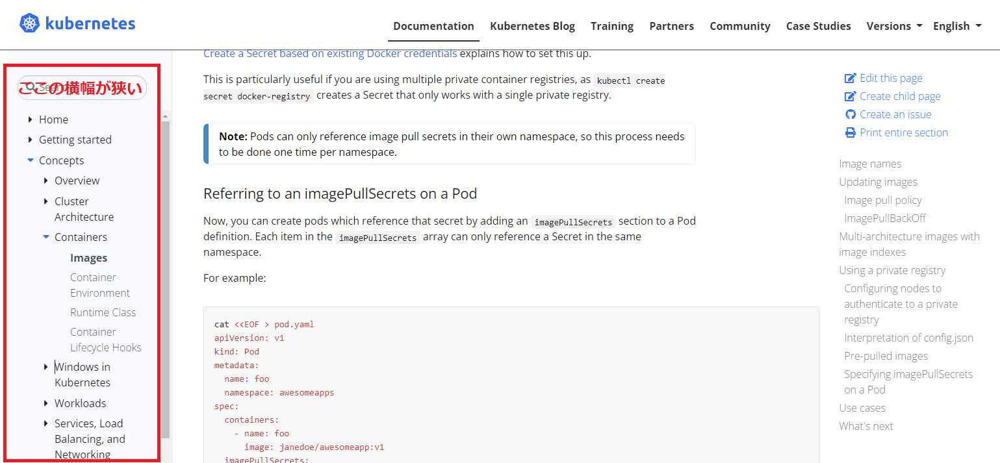
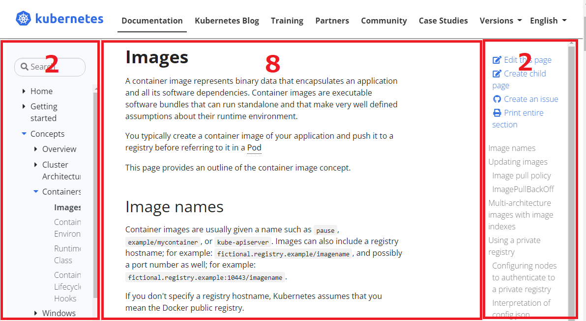
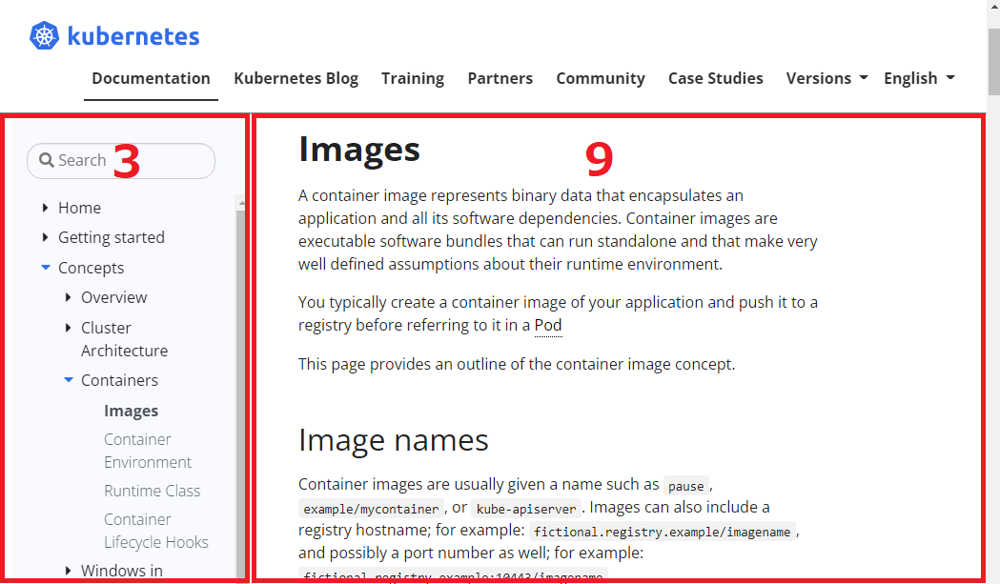
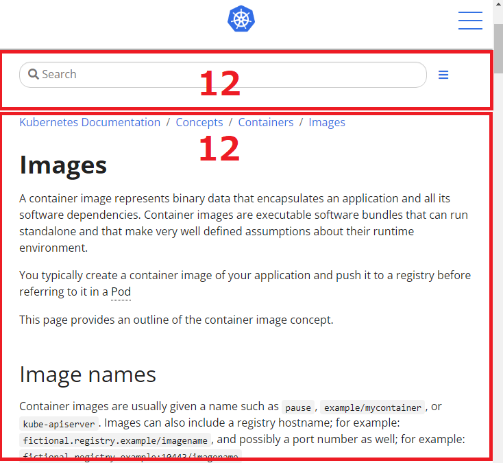
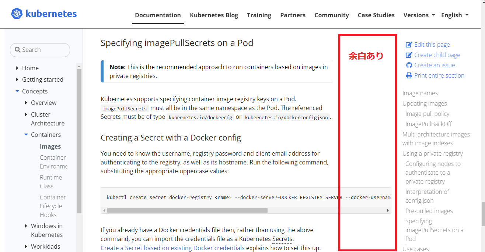
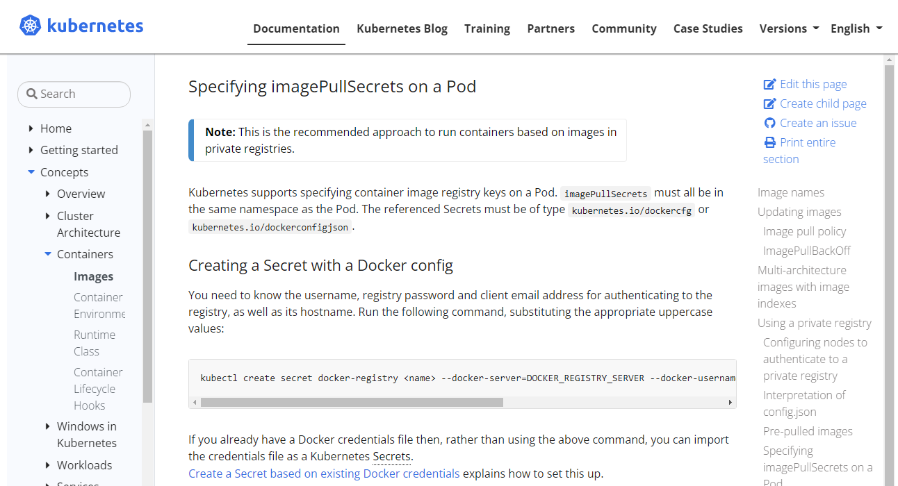

# websiteのレイアウトについての調査メモ

## 課題

websiteのツリーが狭くて、とても見づらい。



## 調査メモ

### 横幅はどうやって決めているか

* グリッドシステムという手法が使われています。

  画面の横幅については、割合を定義しています。
  画面サイズ(ブラウザのサイズ)ごとに使用することができます。
  
  |                     |Extra small    |Small        |Medium       |Large        |Extra large  |
  |---                  |---            |---          |---          |---          |---          |
  |width                |＜576px        |≧576px      |≧768px      |≧992px      |≧1200px     |
  |Max container width  |None(auto)     |540px        |720px        |960px        |1140px       |
  |Class prefix         |-col-          |-col-sm-     |-col-md-     |-col-lg-     |-col-xl-     |
  |# of columns         |12             |             |             |             |             |
  |Gutter width         |30px(15px on each side of a column)  |  |  |             |             |
  |Nestable             |Yes            |             |             |             |             |
  |Column ordering      |Yes            |             |             |             |             |

* k8s-websiteでは以下に定義があります。
 
  website/layouts/docs/baseof.html

  ```html
  <!doctype html>
  <html lang="{{ .Site.Language.Lang }}" class="no-js">
    <head>
      {{ partial "head.html" . }}
      <title>{{ if .IsHome }}{{ .Site.Title }}{{ else }}{{ with .Title }}{{ . }} | {{ end }}{{ .Site.Title }}{{ end }}</title>
    </head>
    <body class="td-{{ .Kind }} td-documentation">
      <header>
        {{ partial "navbar.html" . }}
        {{ partial "announcement.html" . }}
        {{ block "hero" . }}
          <section class="header-hero filler">
          </section>
           {{ block "hero-more" . }}{{ end }}
        {{ end }}
      </header>
      <div class="container-fluid td-outer">
        <div class="td-main">
          <div class="row flex-md-nowrap">
            <div class="col-12 col-md-3 col-xl-2 td-sidebar d-print-none">          //★(1)
              {{ partial "sidebar.html" . }}
            </div>
            <main class="col-12 col-md-9 col-xl-8 pl-md-5" role="main">             //★(2)
              {{ if not .Site.Params.ui.breadcrumb_disable }}{{ partial "breadcrumb.html" . }}{{ end }}
              {{ block "deprecated" . }}
                {{ partial "deprecation-warning.html" . }}
              {{ end }}
                {{ block "main" . }}{{ end }}
                {{- if .HasShortcode "thirdparty-content" -}}
                  {{ block "thirdparty-disclaimer" . }}
                    {{ partial "docs/thirdparty-disclaimer.html" . }}
                  {{- end -}}
                {{- end -}}
              {{ if (and (not .Params.hide_feedback) (.Site.Params.ui.feedback.enable) (.Site.GoogleAnalytics)) }}
                {{ partial "feedback.html" .Site.Params.ui.feedback }}
              {{ end }}
              {{ partial "page-meta-lastmod.html" . }}
              {{ if (.Site.DisqusShortname) }}
                <br />
                {{ partial "disqus-comment.html" . }}
              {{ end }}
            </main>
            <div class="d-none d-xl-block col-xl-2 td-toc d-print-none">            //★(3)
              {{ partial "toc.html" . }}
            </div>
          </div>
        </div>
      </div>
      {{ partial "footer.html" . }}
      {{ partial "scripts.html" . }}
    </body>
  </html>
  ```
  
  上記の(1)(2)(3)がそれぞれ、左サイドバー、中央ドキュメント領域、右目次領域の情報です。
  * (1) col-12 col-md-3 col-xl-2
  * (2) col-12 col-md-9 col-xl-8
  * (3) col-xl-2
 
  この設定は以下。
  * 1200px以上(col-xl-)の場合、(1):(2):(3)=2:8:2 のサイズになる。
  * 768px以上(col-md-)の場合、(1):(2)=3:9のサイズになる。(3)は非表示。
  * 576px未満(col-)の場合、(1)と(2)が縦に並ぶ。(3)は非表示。
    * col-12 は、横幅いっぱいに表示することを示しているので、(1)(2)共に横幅いっぱいになる＝縦に並ぶ

* 1200px以上

  

* 768px以上

  

* 576px未満

  

### 本文の右側に余白が多い

* 中央のドキュメント領域の右側に余白あり

  
  
* 以下で横幅を80%に制限しています。

  website/themes/docsy/assets/scss/support/_utilities.scss

  ```css
  .td-max-width-on-larger-screens {
      @include media-breakpoint-up(lg) {
          max-width: 80%;                           //★
      }
  }
  ```

  ただし、このファイルは、"website/themes/docsy @ 1c77bb2" となっており、実体がgoogle/docsyリポジトリにあるので、このファイルを修正するわけにはいかない。
  
* 類似のIssue/PRとしてコードブロックを幅を広げるものがありました。

  * Issue: <https://github.com/kubernetes/website/issues/30097>
  * PR: <https://github.com/kubernetes/website/pull/30142>

  この修正では、以下のコードを追加しています。
  
  website/assets/scss/_custom.scss
  
  ```css
  .td-documentation .td-content > .highlight {
    max-width: initial;
    width: 100%;
  }  
  ```

* 同じように以下のコード追加で改善できる。

  ```css
  .td-documentation .td-content > p {
    max-width: initial;
    width: 100%;
  }  
  ```

  
  

