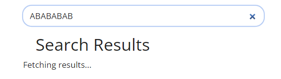

# websiteの検索について

kubernetesドキュメントサイト( https://kubernetes.io/docs/home/ )の検索処理についての調査結果です。

## 検索処理の流れ

1. 検索画面は以下で定義されています。

    https://github.com/kubernetes/website/blame/main/layouts/_default/search.html#L42-L46
    
    関連箇所は以下
    
    ```html
    <script src="{{ "js/search.js" | relURL }}"></script>
    <gcse:searchresults-only linktarget="_parent">
      <div id="bing-results-container">{{ T "layouts_docs_search_fetching" }}</div>
      <div id="bing-pagination-container"></div>
    </gcse:searchresults-only>    
    ```

2. 検索を実行すると、[search.js](https://github.com/kubernetes/website/blob/main/static/js/search.js)が実行されます。

    ```js
    if (getCookie("is_china") === "") {
        $.ajax({
            url: "https://ipinfo.io?token=796e43f4f146b1",
            dataType: "jsonp",
            success: function (response) {
                if (response.country == 'CN') {
                    window.renderBingSearchResults()
                    document.cookie = "is_china=true;" + path + expires
                } else {
                    window.renderGoogleSearchResults()
                    document.cookie = "is_china=false;" + path + expires;
                }
            },
            error: function () {
                window.renderBingSearchResults()
                document.cookie = "is_china=true;" + path + expires;
            },
            timeout: 3000
        });
    } else if (getCookie("is_china") === "true") {
        window.renderBingSearchResults()
    } else {
        window.renderGoogleSearchResults()
    }
    ```
    
    * 最初は"is_china"がありませんので、cookieにis_chinaを登録します。
      プロキシにより "https://ipinfo.io?token=796e43f4f146b1" へのアクセスがブロックされてしまうと、error条件となり"is_china=true"が設定されます。
    * is_china=trueの場合は、検索エンジンにBingが使用されます。
    * is_china=falseの場合は、検索エンジンにGoogleが使用されます。

3. Bingエンジンの場合、renderBingSearchResults()が呼ばれます。

    ```js
    window.renderBingSearchResults = () => {
        var searchTerm  = window.location.search.split("=")[1].split("&")[0].replace(/%20/g,' '),
            page        = window.location.search.split("=")[2],
            q           = "site:kubernetes.io " + searchTerm;

        page = (!page) ?  1 : page.split("&")[0];

        var results = '', pagination = '', offset = (page - 1) * 10, ajaxConf = {};

        ajaxConf.url = 'https://api.cognitive.microsoft.com/bingcustomsearch/v7.0/search';
        ajaxConf.data =  { q: q, offset: offset, customConfig: '320659264' };
        ajaxConf.type = "GET";
        ajaxConf.beforeSend = function(xhr){ xhr.setRequestHeader('Ocp-Apim-Subscription-Key', '51efd23677624e04b4abe921225ea7ec'); };

        $.ajax(ajaxConf).done(function(res) {
            if (res.webPages == null) return; // If no result, 'webPages' is 'undefined'          //(1)
            var paginationAnchors = window.getPaginationAnchors(Math.ceil(res.webPages.totalEstimatedMatches / 10));
            res.webPages.value.map(ob => { results += window.getResultMarkupString(ob); })

            if($('#bing-results-container').length > 0) $('#bing-results-container').html(results);     //(2)
            if($('#bing-pagination-container').length > 0) $('#bing-pagination-container').html(paginationAnchors);     //(3)
        });
    }
    ```
    
    * (1)のところで検索結果がnull(検索結果が無い)場合の処理がありません。
      ここに処理が無いため、"Fetching results..." から画面が更新されません。
    * 検索結果がある場合には、(2)のところで検索結果を表示しています。
    * さらに、(3)のところで、検索結果のページ用アンカーを表示しています。
      ページ用アンカーは、getPaginationAnchors() で生成しています。
      ```js
      window.getPaginationAnchors = (pages) => {
          var pageAnchors = '', searchTerm  = window.location.search.split("=")[1].split("&")[0].replace(/%20/g, ' ');
          var currentPage = window.location.search.split("=")[2];
          currentPage = (!currentPage) ?  1 : currentPage.split("&")[0];

          for(var i = 1; i <= 10; i++){
              if(i > pages) break;
              pageAnchors += '<a class="bing-page-anchor" href="/search/?q='+searchTerm+'&page='+i+'">';
              pageAnchors += (currentPage == i) ? '<b>'+i+'</b>' : i;
              pageAnchors += '</a>';
          }
          return pageAnchors;
      }
      ```

4. Googleエンジンの場合、renderGoogleSearchResults()が呼ばれます。

    ```js
    window.renderGoogleSearchResults = () => {
        var cx = '013288817511911618469:elfqqbqldzg';
        var gcse = document.createElement('script');
        gcse.type = 'text/javascript';
        gcse.async = true;
        gcse.src = (document.location.protocol == 'https:' ? 'https:' : 'http:') + '//cse.google.com/cse.js?cx=' + cx;
        var s = document.getElementsByTagName('script')[0];
        s.parentNode.insertBefore(gcse, s);
    }    
    ```

## Bingエンジンで検索結果がnullの場合の対処例

```
window.renderBingSearchResults = () => {
    var searchTerm  = window.location.search.split("=")[1].split("&")[0].replace(/%20/g,' '),
        page        = window.location.search.split("=")[2],
        q           = "site:kubernetes.io " + searchTerm;

    page = (!page) ?  1 : page.split("&")[0];

    var results = '', pagination = '', offset = (page - 1) * 10, ajaxConf = {};

    ajaxConf.url = 'https://api.cognitive.microsoft.com/bingcustomsearch/v7.0/search';
    ajaxConf.data =  { q: q, offset: offset, customConfig: '320659264' };
    ajaxConf.type = "GET";
    ajaxConf.beforeSend = function(xhr){ xhr.setRequestHeader('Ocp-Apim-Subscription-Key', '51efd23677624e04b4abe921225ea7ec'); };

    $.ajax(ajaxConf).done(function(res) {
        if (res.webPages == null){                                  //(1)
            $('#bing-results-container').html("No data.");          //★ "No Results."を表示
            return;
        }
        var paginationAnchors = window.getPaginationAnchors(Math.ceil(res.webPages.totalEstimatedMatches / 10));
        res.webPages.value.map(ob => { results += window.getResultMarkupString(ob); })

        if($('#bing-results-container').length > 0) $('#bing-results-container').html(results);     //(2)
        if($('#bing-pagination-container').length > 0) $('#bing-pagination-container').html(paginationAnchors);     //(3)
    });
}
```

* 修正前

    |  |
    | --- |

* 修正後

    |  |
    | --- |

## Bingエンジンの検索結果のページ用アンカーの表示改善例

```js
window.getPaginationAnchors = (pages) => {
    var pageAnchors = '', searchTerm  = window.location.search.split("=")[1].split("&")[0].replace(/%20/g, ' ');
    var currentPage = window.location.search.split("=")[2];
    currentPage = (!currentPage) ?  1 : currentPage.split("&")[0];


    for(var i = 1; i <= 10; i++){
        if(i > pages) break;
        pageAnchors += '<a class="bing-page-anchor" href="/search/?q='+searchTerm+'&page='+i+'">';
        pageAnchors += (currentPage == i) ? '<b>'+i+'</b>' : i;
        pageAnchors += '</a>';
        pageAnchors += '&nbsp;&nbsp;&nbsp;'     //★ アンカーの間にスペースを入れる
    }
    return pageAnchors;
}
```

* 修正前

    |  |
    | --- |

* 修正後

    |  |
    | --- |

## Bingエンジンで日本語対応の対応例

```js
window.renderBingSearchResults = () => {
    var searchTerm  = window.location.search.split("=")[1].split("&")[0].replace(/%20/g,' '),
        page        = window.location.search.split("=")[2],
        q           = "site:kubernetes.io " + decodeURI(searchTerm);        //★searchTermをdecodeURIする

    page = (!page) ?  1 : page.split("&")[0];

    var results = '', pagination = '', offset = (page - 1) * 10, ajaxConf = {};

    ajaxConf.url = 'https://api.cognitive.microsoft.com/bingcustomsearch/v7.0/search';
    ajaxConf.data =  { q: q, offset: offset, customConfig: '320659264' };
    ajaxConf.type = "GET";
    ajaxConf.beforeSend = function(xhr){ xhr.setRequestHeader('Ocp-Apim-Subscription-Key', '51efd23677624e04b4abe921225ea7ec'); };

    $.ajax(ajaxConf).done(function(res) {
        if (res.webPages == null) {
            $('#bing-results-container').html("No Results.");
            return;
        } // If no result, 'webPages' is 'undefined'
        var paginationAnchors = window.getPaginationAnchors(Math.ceil(res.webPages.totalEstimatedMatches / 10));
        res.webPages.value.map(ob => { results += window.getResultMarkupString(ob); })

        if($('#bing-results-container').length > 0) $('#bing-results-container').html(results);
        if($('#bing-pagination-container').length > 0) $('#bing-pagination-container').html(paginationAnchors);
    });
}
```

* 修正前

    |  |
    | --- |

* 修正後

    |  |
    | --- |

## 検索エンジンをGoogleに変更すると

* 検索結果

    |  |
    | --- |
    
* ページのアンカー

    |  |
    | --- |

* 検索結果が無い

    |  |
    | --- |
